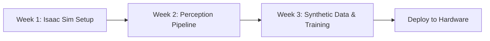

# Module 3: The AI-Robot Brain (NVIDIA Isaac Platform)

## 📚 Learning Path Overview

**Duration:** 3 weeks (12-16 hours/week)
**Difficulty:** Advanced
**Prerequisites:**
- ✅ Completed Modules 1 & 2 (ROS 2 + Simulation)
- ✅ Python programming with NumPy
- ✅ Basic machine learning concepts
- ✅ GPU/CUDA awareness (helpful but not required)

**Learning Progression:**


**By the end of this module:**
- ✅ Use NVIDIA Isaac Sim for photorealistic GPU-accelerated simulation
- ✅ Implement perception pipelines (object detection, segmentation, depth)
- ✅ Generate massive synthetic datasets for ML training
- ✅ Deploy trained models on real robots with Isaac ROS

---

## Week 1: Isaac Sim - GPU-Accelerated Photorealistic Simulation

### 🎯 Learning Objectives
1. Set up NVIDIA Isaac Sim and understand Omniverse architecture
2. Create photorealistic environments with RTX ray tracing
3. Simulate robots with physics (PhysX 5) at real-time speeds
4. Interface Isaac Sim with ROS 2

### 📖 Theory

**Why Isaac Sim?**
```
┌─────────────────┬──────────┬──────────┬────────────┐
│    Feature      │  Gazebo  │  Unity   │ Isaac Sim  │
├─────────────────┼──────────┼──────────┼────────────┤
│ Graphics        │ Moderate │ High     │ Photorealistic (RTX) │
│ Physics         │ Accurate │ Good     │ PhysX 5 (GPU) │
│ Performance     │ CPU      │ GPU      │ GPU (10-100x faster) │
│ ML Integration  │ Limited  │ Good     │ Excellent  │
│ Synthetic Data  │ Basic    │ Good     │ Domain Randomization │
│ ROS 2 Support   │ Native   │ Bridge   │ Isaac ROS  │
└─────────────────┴──────────┴──────────┴────────────┘
```

**Isaac Sim Architecture:**
- **Omniverse Kit:** Core USD (Universal Scene Description) framework
- **PhysX 5:** GPU-accelerated physics engine
- **RTX Ray Tracing:** Photorealistic rendering with ray-traced lighting
- **Isaac Gym:** RL training with thousands of parallel simulations
- **Isaac ROS:** Hardware-accelerated perception for deployment

### 💻 Code Example 1: Isaac Sim Python API - Spawn Robot

```python
# File: isaac_sim_spawn_robot.py
# Run this inside Isaac Sim Python environment

from omni.isaac.kit import SimulationApp

# Initialize simulation
simulation_app = SimulationApp({"headless": False})

from omni.isaac.core import World
from omni.isaac.core.robots import Robot
from omni.isaac.core.utils.stage import add_reference_to_stage
import carb

# Create world
world = World(stage_units_in_meters=1.0)

# Add ground plane
world.scene.add_default_ground_plane()

# Import robot URDF/USD
robot_usd_path = "omniverse://localhost/NVIDIA/Assets/Isaac/2023.1.1/Isaac/Robots/Franka/franka.usd"

# Spawn robot at position
robot_prim_path = "/World/Franka"
add_reference_to_stage(usd_path=robot_usd_path, prim_path=robot_prim_path)

# Create robot interface
robot = world.scene.add(
    Robot(
        prim_path=robot_prim_path,
        name="franka_robot",
        position=[0, 0, 0]
    )
)

# Reset world
world.reset()

print("Robot spawned successfully!")
print(f"Robot DOF: {robot.num_dof}")
print(f"Joint names: {robot.dof_names}")

# Simulation loop
while simulation_app.is_running():
    # Step physics
    world.step(render=True)

    # Get robot state
    if world.is_playing():
        joint_positions, joint_velocities = robot.get_joint_positions(), robot.get_joint_velocities()

        # Simple control: move joints sinusoidally
        import numpy as np
        time = world.current_time_step_index * 0.01
        target_positions = np.sin(time + np.arange(robot.num_dof)) * 0.3

        robot.set_joint_positions(target_positions)

# Cleanup
simulation_app.close()
```

### 💻 Code Example 2: Isaac ROS Integration

```python
# File: isaac_ros_bridge.py
import rclpy
from rclpy.node import Node
from sensor_msgs.msg import Image, CameraInfo
from geometry_msgs.msg import Twist
from cv_bridge import CvBridge
import numpy as np

# Must run inside Isaac Sim
from omni.isaac.core import World
from omni.isaac.core.utils.extensions import enable_extension
enable_extension("omni.isaac.ros2_bridge")

from omni.isaac.sensor import Camera
from omni.isaac.core.prims import XFormPrim

class IsaacROSBridge(Node):
    def __init__(self, world):
        super().__init__('isaac_ros_bridge')

        self.world = world
        self.bridge = CvBridge()

        # Create ROS 2 publishers
        self.image_pub = self.create_publisher(Image, '/isaac/camera/image', 10)
        self.depth_pub = self.create_publisher(Image, '/isaac/camera/depth', 10)
        self.camera_info_pub = self.create_publisher(CameraInfo, '/isaac/camera/info', 10)

        # Subscribe to velocity commands
        self.cmd_vel_sub = self.create_subscription(
            Twist,
            '/cmd_vel',
            self.cmd_vel_callback,
            10
        )

        # Add camera to scene
        self.camera = world.scene.add(
            Camera(
                prim_path="/World/Camera",
                position=np.array([2.0, 0.0, 1.5]),
                frequency=30,
                resolution=(1280, 720)
            )
        )

        # Timer for publishing
        self.create_timer(0.033, self.publish_camera_data)  # 30 Hz

        self.get_logger().info('Isaac ROS Bridge ready')

    def cmd_vel_callback(self, msg):
        """Receive velocity commands from ROS"""
        linear_x = msg.linear.x
        angular_z = msg.angular.z

        self.get_logger().info(f'Received cmd_vel: linear={linear_x}, angular={angular_z}')

        # Apply to robot in Isaac Sim
        # (Implementation depends on robot type - differential drive, omni, etc.)

    def publish_camera_data(self):
        """Publish camera images to ROS topics"""
        if not self.world.is_playing():
            return

        # Get RGB image
        rgb_data = self.camera.get_rgba()[:, :, :3]  # Drop alpha channel

        # Get depth image
        depth_data = self.camera.get_depth()

        # Convert to ROS messages
        rgb_msg = self.bridge.cv2_to_imgmsg(rgb_data, encoding='rgb8')
        rgb_msg.header.stamp = self.get_clock().now().to_msg()
        rgb_msg.header.frame_id = 'isaac_camera'

        depth_msg = self.bridge.cv2_to_imgmsg(depth_data, encoding='32FC1')
        depth_msg.header = rgb_msg.header

        # Publish
        self.image_pub.publish(rgb_msg)
        self.depth_pub.publish(depth_msg)

        # Camera info
        info_msg = CameraInfo()
        info_msg.header = rgb_msg.header
        info_msg.width = 1280
        info_msg.height = 720
        # Fill in intrinsics...
        self.camera_info_pub.publish(info_msg)

def main():
    # Initialize Isaac Sim
    from omni.isaac.kit import SimulationApp
    simulation_app = SimulationApp({"headless": False})

    # Initialize ROS 2
    rclpy.init()

    # Create world
    world = World()
    world.scene.add_default_ground_plane()
    world.reset()

    # Create ROS bridge node
    bridge_node = IsaacROSBridge(world)

    # Simulation loop
    import threading

    def ros_spin():
        rclpy.spin(bridge_node)

    ros_thread = threading.Thread(target=ros_spin, daemon=True)
    ros_thread.start()

    while simulation_app.is_running():
        world.step(render=True)

    # Cleanup
    bridge_node.destroy_node()
    rclpy.shutdown()
    simulation_app.close()

if __name__ == '__main__':
    main()
```

### 🔬 Lab Exercise 1: Warehouse Environment

**Task:** Build a photorealistic warehouse in Isaac Sim
1. Import warehouse USD assets from Omniverse library
2. Add shelves, boxes, and pallets
3. Configure RTX lighting (sun, area lights)
4. Spawn a mobile robot (Carter, Jetbot, or custom)
5. Stream camera feed to ROS 2

**Bonus Challenge:**
- Add conveyor belts with PhysX
- Implement random object spawning

**Deliverable:**
- Isaac Sim USD scene file
- ROS 2 node that receives images
- Screenshot/video of photorealistic rendering

### ✅ Week 1 Assessment Checklist
- [ ] Install NVIDIA Isaac Sim (Omniverse)
- [ ] Spawn robot using Python API
- [ ] Configure camera and lighting
- [ ] Publish sensor data to ROS 2 topics
- [ ] Understand USD scene graph structure

---

## Week 2: Perception Pipeline - Object Detection & Segmentation

### 🎯 Learning Objectives
1. Use Isaac Sim synthetic data generation
2. Implement object detection with NVIDIA TAO/Triton
3. Perform semantic/instance segmentation
4. Deploy perception models with Isaac ROS GEMs

### 📖 Theory

**Synthetic Data for Perception:**
```
Traditional Approach          Isaac Sim Approach
├─ Collect real images        ├─ Generate infinite data
├─ Manual labeling            ├─ Perfect auto-labels
├─ Limited scenarios          ├─ Domain randomization
├─ Expensive & slow           ├─ Free & instant
└─ Privacy concerns           └─ No privacy issues
```

**Domain Randomization:**
Vary lighting, textures, object positions, camera angles to train robust models that generalize to real world.

**Isaac ROS GEMs (Graph Execution Modules):**
- Hardware-accelerated perception nodes
- GPU-optimized DNN inference (TensorRT)
- Run on Jetson/x86 with CUDA

### 💻 Code Example 3: Synthetic Data Generation

```python
# File: generate_synthetic_dataset.py
from omni.isaac.kit import SimulationApp
simulation_app = SimulationApp({"headless": True})  # Headless for speed

from omni.isaac.core import World
from omni.isaac.core.utils.stage import add_reference_to_stage
from omni.replicator.core import BasicWriter, AnnotatorRegistry
import omni.replicator.core as rep
import random

# Create world
world = World()
world.scene.add_default_ground_plane()

# Add camera
camera = rep.create.camera(position=(3, 0, 2), look_at=(0, 0, 0.5))

# Define object library
object_models = [
    "omniverse://localhost/NVIDIA/Assets/ArchVis/Commercial/Warehouse/Props/SM_CardboardBox_A_01.usd",
    "omniverse://localhost/NVIDIA/Assets/ArchVis/Commercial/Warehouse/Props/SM_PalletJack_01.usd",
    # Add more objects...
]

def randomize_scene():
    """Randomize lighting, objects, and camera for domain randomization"""

    # Random lighting
    with rep.trigger.on_frame():
        # Randomize dome light
        light = rep.create.light(
            light_type="Dome",
            intensity=rep.distribution.uniform(500, 2000),
            rotation=rep.distribution.uniform((0, 0, 0), (360, 360, 360))
        )

        # Randomize object positions
        num_objects = random.randint(5, 15)
        for _ in range(num_objects):
            obj_model = random.choice(object_models)

            obj = rep.create.from_usd(obj_model)

            with obj:
                rep.modify.pose(
                    position=rep.distribution.uniform((-2, -2, 0.1), (2, 2, 1.5)),
                    rotation=rep.distribution.uniform((0, 0, 0), (360, 360, 360))
                )

                # Random material/texture
                rep.randomizer.materials(
                    materials=rep.get.prims(semantics=[("class", "material")])
                )

        # Random camera angle
        with camera:
            rep.modify.pose(
                position=rep.distribution.uniform((2, -2, 1), (4, 2, 3)),
                look_at=(0, 0, 0.5)
            )

# Setup annotations (labels)
render_product = rep.create.render_product(camera, (1280, 720))

# Register writers for different annotations
rgb_writer = rep.WriterRegistry.get("BasicWriter")
rgb_writer.initialize(
    output_dir="./synthetic_data/rgb",
    rgb=True
)

bbox_writer = rep.WriterRegistry.get("BasicWriter")
bbox_writer.initialize(
    output_dir="./synthetic_data/labels",
    bounding_box_2d_tight=True,
    semantic_segmentation=True
)

# Attach to render product
rgb_writer.attach([render_product])
bbox_writer.attach([render_product])

# Generate dataset
NUM_FRAMES = 1000

world.reset()

with rep.trigger.on_frame(num_frames=NUM_FRAMES):
    randomize_scene()

# Run simulation
print(f"Generating {NUM_FRAMES} synthetic training images...")

for frame in range(NUM_FRAMES):
    world.step(render=True)

    if frame % 100 == 0:
        print(f"Progress: {frame}/{NUM_FRAMES} frames")

print("Dataset generation complete!")
print("Output: ./synthetic_data/")

simulation_app.close()
```

### 💻 Code Example 4: Deploy Perception with Isaac ROS

```python
# File: isaac_ros_perception.py
import rclpy
from rclpy.node import Node
from sensor_msgs.msg import Image
from vision_msgs.msg import Detection2DArray, Detection2D
from cv_bridge import CvBridge
import numpy as np

# Isaac ROS GEM for DNN inference
try:
    from isaac_ros_dnn_inference import TensorRTNode
    ISAAC_ROS_AVAILABLE = True
except ImportError:
    ISAAC_ROS_AVAILABLE = False
    print("WARNING: Isaac ROS not available, using CPU inference")

class PerceptionPipeline(Node):
    def __init__(self):
        super().__init__('perception_pipeline')

        self.bridge = CvBridge()

        # Subscribe to camera
        self.image_sub = self.create_subscription(
            Image,
            '/isaac/camera/image',
            self.image_callback,
            10
        )

        # Publish detections
        self.detection_pub = self.create_publisher(
            Detection2DArray,
            '/detections',
            10
        )

        # Load object detection model (YOLOv8, DOPE, etc.)
        if ISAAC_ROS_AVAILABLE:
            # Use TensorRT for GPU acceleration
            self.model = self.load_tensorrt_model()
        else:
            # Fallback to ONNX/PyTorch CPU
            self.model = self.load_cpu_model()

        self.get_logger().info('Perception pipeline ready')

    def load_tensorrt_model(self):
        """Load TensorRT optimized model for Jetson/CUDA"""
        # Placeholder - actual implementation uses Isaac ROS GEMs
        self.get_logger().info('Loading TensorRT model for GPU inference')
        return None  # Would return TensorRT engine

    def load_cpu_model(self):
        """Fallback CPU inference"""
        # Example: load YOLOv8 with ultralytics
        try:
            from ultralytics import YOLO
            model = YOLO('yolov8n.pt')
            self.get_logger().info('Loaded YOLOv8 CPU model')
            return model
        except:
            self.get_logger().warn('Could not load model')
            return None

    def image_callback(self, msg):
        """Process camera image for object detection"""
        # Convert ROS image to OpenCV
        cv_image = self.bridge.imgmsg_to_cv2(msg, desired_encoding='rgb8')

        # Run inference
        detections = self.detect_objects(cv_image)

        # Publish results
        detection_msg = Detection2DArray()
        detection_msg.header = msg.header
        detection_msg.detections = detections

        self.detection_pub.publish(detection_msg)

        self.get_logger().info(f'Detected {len(detections)} objects')

    def detect_objects(self, image):
        """Run object detection inference"""
        if self.model is None:
            return []

        # Run model
        results = self.model(image, conf=0.5)

        # Convert to ROS Detection2D messages
        detections = []

        for result in results:
            for box in result.boxes:
                detection = Detection2D()

                # Bounding box
                x1, y1, x2, y2 = box.xyxy[0].cpu().numpy()
                detection.bbox.center.position.x = float((x1 + x2) / 2)
                detection.bbox.center.position.y = float((y1 + y2) / 2)
                detection.bbox.size_x = float(x2 - x1)
                detection.bbox.size_y = float(y2 - y1)

                # Class and confidence
                # detection.results[0].hypothesis.class_id = str(int(box.cls))
                # detection.results[0].hypothesis.score = float(box.conf)

                detections.append(detection)

        return detections

def main(args=None):
    rclpy.init(args=args)
    node = PerceptionPipeline()
    rclpy.spin(node)
    node.destroy_node()
    rclpy.shutdown()

if __name__ == '__main__':
    main()
```

### 🔬 Lab Exercise 2: Train Object Detector on Synthetic Data

**Task:**
1. Generate 5,000 synthetic images in Isaac Sim with domain randomization
2. Export in COCO or YOLO format
3. Train YOLOv8 or TAO model
4. Deploy on Isaac ROS with TensorRT
5. Test on real camera feed

**Metrics:**
- Measure inference FPS (CPU vs GPU)
- Calculate mAP on test set
- Compare sim-trained vs real-trained

**Deliverable:**
- Trained model weights (.pt or .engine)
- Training curves (loss, mAP)
- Inference demo video

### ✅ Week 2 Assessment Checklist
- [ ] Generate 1000+ synthetic labeled images
- [ ] Train object detection model
- [ ] Convert model to TensorRT
- [ ] Deploy with Isaac ROS GEM
- [ ] Measure inference performance (FPS, accuracy)

---

## Week 3: Deployment & Sim-to-Real Transfer

### 🎯 Learning Objectives
1. Understand sim-to-real gap challenges
2. Use domain randomization techniques
3. Deploy perception to NVIDIA Jetson
4. Integrate with navigation stack

### 📖 Theory

**Sim-to-Real Gap:**
```
Simulation                 Real World
├─ Perfect sensors         ├─ Noisy sensors
├─ Known lighting          ├─ Variable lighting
├─ Clean textures          ├─ Dirt, reflections
├─ Exact physics           ├─ Imperfect physics
└─ No occlusions           └─ Dynamic occlusions
```

**Bridging the Gap:**
1. **Domain Randomization:** Vary everything (lighting, textures, noise)
2. **Sensor Realism:** Add noise models matching real sensors
3. **Progressive Training:** Start sim, fine-tune on small real data
4. **Sim2Real Metrics:** Test on real before deployment

### 🔬 Lab Exercise 3: Full Navigation Pipeline

**Task:** Deploy complete autonomy stack
1. **Perception:** Object detection + depth
2. **Localization:** SLAM or visual odometry
3. **Planning:** Nav2 with costmaps
4. **Control:** Pure pursuit or DWA
5. **Test:** Navigate warehouse (sim → real)

**Integration:**
```
Isaac Sim → Perception (Isaac ROS) → SLAM → Nav2 → Robot
```

**Deliverable:**
- Working navigation in Isaac Sim
- Deployment on Jetson (or PC with CUDA)
- Video of autonomous navigation

### ✅ Week 3 Assessment Checklist
- [ ] Apply domain randomization to training
- [ ] Deploy model on Jetson/GPU hardware
- [ ] Integrate perception with Nav2
- [ ] Test sim-to-real transfer
- [ ] Document performance gaps and solutions

---

## 📝 Module Summary

### Key Concepts Mastered
1. **Isaac Sim GPU Simulation**
   - Photorealistic RTX rendering
   - PhysX 5 GPU-accelerated physics
   - Python API for scene creation

2. **Synthetic Data Generation**
   - Domain randomization techniques
   - Perfect auto-labeling with USD
   - Massive dataset creation (1000s of images)

3. **Hardware-Accelerated Perception**
   - TensorRT optimization
   - Isaac ROS GEMs deployment
   - Real-time inference on Jetson

4. **Sim-to-Real Transfer**
   - Understanding the reality gap
   - Techniques to bridge gap
   - Progressive training strategies

### Real-World Applications
- **Autonomous Warehouses:** Train robots on synthetic warehouse data
- **Manipulation:** Pick-and-place with vision-based grasping
- **Inspection:** Defect detection trained on CAD + randomization
- **Agriculture:** Crop detection without manual labeling

### Common Pitfalls & Solutions
| Problem | Solution |
|---------|----------|
| Isaac Sim crashes | Check GPU drivers (NVIDIA 525+), reduce render quality |
| Slow inference | Use TensorRT, reduce model size, batch images |
| Poor sim-to-real transfer | Increase randomization, add sensor noise |
| USD scene too large | Use instancing, LODs, optimize assets |

### Next Steps
✅ Module 4: VLA (Vision-Language-Action models)
✅ Deploy full autonomy stack on hardware
✅ Explore Isaac Gym for RL training

---

## 🎓 Final Project: Sim-to-Real Object Manipulation

**Objective:** Train a robot arm to grasp objects using only synthetic data.

**Requirements:**
1. **Simulation:** Isaac Sim with Franka robot arm
2. **Data:** Generate 10,000 images with random objects/poses
3. **Model:** Train grasp detector (6-DOF pose estimation)
4. **Deployment:** Deploy on real robot arm (or continue in sim)
5. **Evaluation:** Measure grasp success rate

**Grading Rubric:**
- Dataset quality and diversity (20%)
- Model training and optimization (25%)
- TensorRT deployment (20%)
- Sim-to-real analysis (25%)
- Demo video and report (10%)

**Submission:** GitHub repo + trained model + analysis PDF + video

---

## 📚 Additional Resources

**Official Documentation:**
- [Isaac Sim Documentation](https://docs.omniverse.nvidia.com/isaacsim/latest/)
- [Isaac ROS GEMs](https://nvidia-isaac-ros.github.io/repositories_and_packages/)
- [Omniverse Replicator](https://docs.omniverse.nvidia.com/extensions/latest/ext_replicator.html)
- [PhysX 5 SDK](https://nvidia-omniverse.github.io/PhysX/physx/5.3.0/)

**Video Tutorials:**
- [Isaac Sim Getting Started](https://www.youtube.com/nvidia-isaac)
- [Synthetic Data Generation](https://www.youtube.com/watch?v=synthetic-data-isaac)
- [Isaac ROS Deployment](https://developer.nvidia.com/isaac-ros)

**Community:**
- [NVIDIA Omniverse Forums](https://forums.developer.nvidia.com/c/omniverse)
- [Isaac Sim Discord](https://discord.gg/nvidia-isaac)
- [Isaac ROS GitHub](https://github.com/NVIDIA-ISAAC-ROS)

**Recommended Hardware:**
- **Development:** RTX 3060+ (12GB VRAM), 32GB RAM
- **Deployment:** Jetson Orin (for edge) or RTX 4000+ (datacenter)

**Papers:**
- "Domain Randomization for Transferring Deep Neural Networks from Simulation to the Real World"
- "Closing the Sim-to-Real Loop: Adapting Simulation Randomization with Real World Experience"
- "NVIDIA Isaac Gym: High Performance GPU-Based Physics Simulation"
