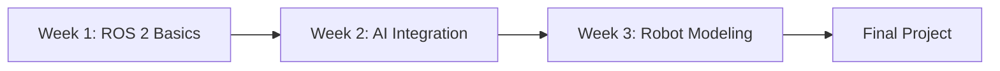

# Module 1: The Robotic Nervous System (ROS 2 Humble)

## 📚 Learning Path Overview

**Duration:** 3 weeks (9-12 hours/week)
**Difficulty:** Intermediate
**Prerequisites:**
- ✅ Python programming (functions, classes, async)
- ✅ Linux command line basics
- ✅ Basic networking concepts

**Learning Progression:**


**By the end of this module:**
- ✅ Build distributed robotics applications with ROS 2
- ✅ Integrate AI/ML models with robot controllers
- ✅ Model robots in URDF and manage transforms
- ✅ Debug and visualize robot systems

---

## Week 1: ROS 2 Architecture & Pub/Sub Pattern

### 🎯 Learning Objectives
1. Understand ROS 2 nodes, topics, and messages
2. Implement publisher-subscriber communication
3. Use Quality of Service (QoS) profiles
4. Visualize system architecture with rqt_graph

### 📖 Theory

**What is ROS 2?**
ROS 2 is a middleware framework for building modular, distributed robot applications. Unlike monolithic programs, ROS 2 allows you to:
- Run different parts of your robot on different computers
- Restart individual components without stopping everything
- Mix languages (Python + C++) seamlessly
- Scale from hobby robots to production systems

**The Pub/Sub Pattern:**
```
Publisher Node          Topic          Subscriber Node
   [Sensor] ---------> /temp_data ---------> [Monitor]
                    (Float32 msg)
```

### 💻 Code Example 1: Temperature Sensor Publisher

```python
# File: temp_publisher.py
import rclpy
from rclpy.node import Node
from std_msgs.msg import Float32
import random

class TempSensorNode(Node):
    def __init__(self):
        super().__init__('temperature_sensor')

        # Create publisher on /temperature topic
        self.publisher = self.create_publisher(Float32, 'temperature', 10)

        # Publish every 1 second
        self.timer = self.create_timer(1.0, self.publish_temperature)

        self.get_logger().info('Temperature sensor started')

    def publish_temperature(self):
        msg = Float32()
        # Simulate sensor reading (20-30°C)
        msg.data = 20.0 + random.uniform(0, 10)

        self.publisher.publish(msg)
        self.get_logger().info(f'Publishing: {msg.data:.2f}°C')

def main(args=None):
    rclpy.init(args=args)
    node = TempSensorNode()
    rclpy.spin(node)
    node.destroy_node()
    rclpy.shutdown()

if __name__ == '__main__':
    main()
```

### 💻 Code Example 2: Temperature Monitor Subscriber

```python
# File: temp_subscriber.py
import rclpy
from rclpy.node import Node
from std_msgs.msg import Float32

class TempMonitorNode(Node):
    def __init__(self):
        super().__init__('temperature_monitor')

        # Subscribe to /temperature topic
        self.subscription = self.create_subscription(
            Float32,
            'temperature',
            self.temperature_callback,
            10
        )

        self.get_logger().info('Temperature monitor started')

    def temperature_callback(self, msg):
        temp = msg.data

        # Alert if temperature is too high
        if temp > 28.0:
            self.get_logger().warn(f'HIGH TEMP ALERT: {temp:.2f}°C')
        else:
            self.get_logger().info(f'Temperature OK: {temp:.2f}°C')

def main(args=None):
    rclpy.init(args=args)
    node = TempMonitorNode()
    rclpy.spin(node)
    node.destroy_node()
    rclpy.shutdown()

if __name__ == '__main__':
    main()
```

### 🚀 Running the Example

```bash
# Terminal 1: Start publisher
cd ~/ros2_ws
source install/setup.bash
python3 temp_publisher.py

# Terminal 2: Start subscriber
cd ~/ros2_ws
source install/setup.bash
python3 temp_subscriber.py

# Terminal 3: Visualize graph
rqt_graph
```

### 📊 System Architecture Diagram

```
┌─────────────────────┐
│  TempSensorNode     │
│  (Publisher)        │
└──────────┬──────────┘
           │ publishes
           ▼
    ┌──────────────┐
    │ /temperature │ (Topic)
    │  Float32     │
    └──────┬───────┘
           │ subscribes
           ▼
┌─────────────────────┐
│  TempMonitorNode    │
│  (Subscriber)       │
└─────────────────────┘
```

### 🔬 Lab Exercise 1: Build a Robot State Publisher

**Task:** Create a two-node system:
1. **state_publisher.py** - Publishes robot battery level (0-100%)
2. **state_monitor.py** - Subscribes and warns when battery < 20%

**Bonus Challenge:**
- Use custom message type `BatteryStatus.msg` with fields: voltage, percentage, charging_status

### ✅ Week 1 Assessment Checklist
- [ ] Create ROS 2 workspace with colcon
- [ ] Build publisher node that sends Float32 messages
- [ ] Build subscriber node that receives and processes messages
- [ ] Use rqt_graph to visualize node connections
- [ ] Implement QoS profile (RELIABLE vs BEST_EFFORT)

---

## Week 2: Bridging Python AI to ROS 2 Controllers

### 🎯 Learning Objectives
1. Integrate AI/ML models into ROS 2 nodes
2. Use ROS 2 Actions for goal-based behaviors
3. Implement service servers and clients
4. Connect OpenAI APIs with robot control

### 📖 Theory

**Why Separate AI from Control?**
```
┌─────────────┐         ┌──────────────┐
│   Python    │ Goals   │     C++      │
│ AI Planner  │────────>│  Controller  │
│ (Slow, ML)  │         │ (Fast, Real  │
└─────────────┘         │   -time)     │
                        └──────────────┘
```

**ROS 2 Actions:** Long-running tasks with feedback
- **Goal:** "Navigate to kitchen"
- **Feedback:** Current position, % complete
- **Result:** Success/Failure

### 💻 Code Example 3: Voice-Controlled Robot

```python
# File: voice_robot_node.py
import rclpy
from rclpy.node import Node
from rclpy.action import ActionServer
from geometry_msgs.msg import Twist
from std_msgs.msg import String
import openai  # pip install openai

class VoiceRobotNode(Node):
    def __init__(self):
        super().__init__('voice_robot')

        # Publisher for robot velocity commands
        self.cmd_vel_pub = self.create_publisher(Twist, '/cmd_vel', 10)

        # Subscriber for voice transcriptions
        self.voice_sub = self.create_subscription(
            String,
            '/voice_input',
            self.voice_callback,
            10
        )

        # OpenAI API key (set as environment variable)
        openai.api_key = "your-api-key-here"

        self.get_logger().info('Voice robot ready!')

    def voice_callback(self, msg):
        command = msg.data.lower()
        self.get_logger().info(f'Heard: {command}')

        # Use GPT to interpret natural language
        response = self.interpret_command(command)

        # Execute motion based on interpretation
        self.execute_motion(response)

    def interpret_command(self, voice_text):
        """Use GPT to convert voice to robot action"""
        prompt = f"""
        Convert this voice command to a robot action.
        Command: "{voice_text}"

        Respond with JSON:
        {{"action": "move_forward|turn_left|turn_right|stop", "speed": 0.0-1.0}}
        """

        response = openai.ChatCompletion.create(
            model="gpt-3.5-turbo",
            messages=[{"role": "user", "content": prompt}]
        )

        import json
        return json.loads(response.choices[0].message.content)

    def execute_motion(self, action_dict):
        """Send velocity commands to robot"""
        twist = Twist()

        action = action_dict.get('action', 'stop')
        speed = action_dict.get('speed', 0.5)

        if action == 'move_forward':
            twist.linear.x = speed
        elif action == 'turn_left':
            twist.angular.z = speed
        elif action == 'turn_right':
            twist.angular.z = -speed
        else:  # stop
            twist.linear.x = 0.0
            twist.angular.z = 0.0

        self.cmd_vel_pub.publish(twist)
        self.get_logger().info(f'Executing: {action} at {speed}')

def main(args=None):
    rclpy.init(args=args)
    node = VoiceRobotNode()
    rclpy.spin(node)
    node.destroy_node()
    rclpy.shutdown()

if __name__ == '__main__':
    main()
```

### 💻 Code Example 4: ROS 2 Action Server

```python
# File: navigate_action_server.py
import rclpy
from rclpy.node import Node
from rclpy.action import ActionServer
from nav_msgs.msg import Odometry
from robot_interfaces.action import NavigateToPoint  # Custom action
import math

class NavigationActionServer(Node):
    def __init__(self):
        super().__init__('navigation_action_server')

        self._action_server = ActionServer(
            self,
            NavigateToPoint,
            'navigate_to_point',
            self.execute_callback
        )

        self.current_x = 0.0
        self.current_y = 0.0

        self.get_logger().info('Navigation action server ready')

    def execute_callback(self, goal_handle):
        """Execute navigation to target point"""
        self.get_logger().info('Executing navigation goal...')

        target_x = goal_handle.request.target_x
        target_y = goal_handle.request.target_y

        feedback_msg = NavigateToPoint.Feedback()

        # Simulate navigation with 10 steps
        for step in range(10):
            if goal_handle.is_cancel_requested:
                goal_handle.canceled()
                return NavigateToPoint.Result(success=False)

            # Update position (simulation)
            self.current_x += (target_x - self.current_x) * 0.1
            self.current_y += (target_y - self.current_y) * 0.1

            # Calculate progress
            distance = math.sqrt(
                (target_x - self.current_x)**2 +
                (target_y - self.current_y)**2
            )

            feedback_msg.current_x = self.current_x
            feedback_msg.current_y = self.current_y
            feedback_msg.distance_remaining = distance

            goal_handle.publish_feedback(feedback_msg)
            self.get_logger().info(f'Progress: {distance:.2f}m remaining')

            rclpy.spin_once(self, timeout_sec=0.5)

        goal_handle.succeed()
        result = NavigateToPoint.Result()
        result.success = True
        return result

def main(args=None):
    rclpy.init(args=args)
    node = NavigationActionServer()
    rclpy.spin(node)
    node.destroy_node()
    rclpy.shutdown()

if __name__ == '__main__':
    main()
```

### 🔬 Lab Exercise 2: AI-Powered Object Detection

**Task:** Build a vision system that:
1. Captures camera images (simulated)
2. Uses YOLOv8 to detect objects
3. Publishes detection results on `/detections` topic
4. Commands robot to approach detected objects

**Files to create:**
- `object_detector.py` - Vision + ML node
- `approach_controller.py` - Motion control node

### ✅ Week 2 Assessment Checklist
- [ ] Create custom message/service definitions
- [ ] Implement action server with feedback
- [ ] Integrate external AI API (OpenAI/HuggingFace)
- [ ] Handle async callbacks properly
- [ ] Test with simulated robot in Gazebo

---

## Week 3: URDF Robot Modeling & Transforms

### 🎯 Learning Objectives
1. Model robots using URDF format
2. Define kinematic chains with joints
3. Use tf2 for coordinate transformations
4. Visualize and debug in RViz

### 📖 Theory

**URDF Structure:**
```xml
<robot name="simple_humanoid">
  <link name="base_link"/>         <!-- Robot body -->
  <link name="right_arm"/>         <!-- Arm link -->

  <joint name="shoulder" type="revolute">
    <parent link="base_link"/>
    <child link="right_arm"/>
    <axis xyz="0 0 1"/>             <!-- Rotation axis -->
    <limit lower="-1.57" upper="1.57"/>
  </joint>
</robot>
```

**Coordinate Frames:**
```
        world
          │
          ▼
      base_link ────> odom
          │
          ├──> left_arm
          │       └──> left_hand
          │
          └──> right_arm
                  └──> right_hand
```

### 💻 Code Example 5: Simple Humanoid URDF

```xml
<!-- File: simple_humanoid.urdf -->
<?xml version="1.0"?>
<robot name="simple_humanoid">

  <!-- Base/Torso -->
  <link name="base_link">
    <visual>
      <geometry>
        <box size="0.3 0.2 0.5"/>
      </geometry>
      <material name="blue">
        <color rgba="0.2 0.4 0.8 1"/>
      </material>
    </visual>
    <collision>
      <geometry>
        <box size="0.3 0.2 0.5"/>
      </geometry>
    </collision>
    <inertial>
      <mass value="10"/>
      <inertia ixx="1.0" ixy="0.0" ixz="0.0"
               iyy="1.0" iyz="0.0" izz="1.0"/>
    </inertial>
  </link>

  <!-- Right Arm -->
  <link name="right_arm">
    <visual>
      <geometry>
        <cylinder length="0.4" radius="0.03"/>
      </geometry>
      <material name="red">
        <color rgba="0.8 0.2 0.2 1"/>
      </material>
    </visual>
    <collision>
      <geometry>
        <cylinder length="0.4" radius="0.03"/>
      </geometry>
    </collision>
    <inertial>
      <mass value="1"/>
      <inertia ixx="0.1" ixy="0.0" ixz="0.0"
               iyy="0.1" iyz="0.0" izz="0.1"/>
    </inertial>
  </link>

  <!-- Right Shoulder Joint -->
  <joint name="right_shoulder" type="revolute">
    <parent link="base_link"/>
    <child link="right_arm"/>
    <origin xyz="0 -0.15 0.2" rpy="0 1.57 0"/>
    <axis xyz="0 0 1"/>
    <limit effort="100" lower="-2.0" upper="2.0" velocity="1.0"/>
  </joint>

  <!-- Camera Sensor -->
  <link name="camera_link">
    <visual>
      <geometry>
        <box size="0.05 0.05 0.03"/>
      </geometry>
      <material name="green">
        <color rgba="0.2 0.8 0.2 1"/>
      </material>
    </visual>
  </link>

  <!-- Camera Joint (fixed to head) -->
  <joint name="camera_joint" type="fixed">
    <parent link="base_link"/>
    <child link="camera_link"/>
    <origin xyz="0.15 0 0.3" rpy="0 0 0"/>
  </joint>

</robot>
```

### 💻 Code Example 6: TF2 Transform Publisher

```python
# File: robot_tf_publisher.py
import rclpy
from rclpy.node import Node
from tf2_ros import TransformBroadcaster
from geometry_msgs.msg import TransformStamped
import math

class RobotTFPublisher(Node):
    def __init__(self):
        super().__init__('robot_tf_publisher')

        self.tf_broadcaster = TransformBroadcaster(self)

        # Publish transforms at 50 Hz
        self.timer = self.create_timer(0.02, self.publish_transforms)

        self.shoulder_angle = 0.0  # Current joint angle

        self.get_logger().info('TF Publisher started')

    def publish_transforms(self):
        # Animate shoulder joint
        self.shoulder_angle += 0.01
        if self.shoulder_angle > 2.0:
            self.shoulder_angle = -2.0

        # Publish base_link -> right_arm transform
        t = TransformStamped()
        t.header.stamp = self.get_clock().now().to_msg()
        t.header.frame_id = 'base_link'
        t.child_frame_id = 'right_arm'

        # Position
        t.transform.translation.x = 0.0
        t.transform.translation.y = -0.15
        t.transform.translation.z = 0.2

        # Rotation (quaternion from shoulder angle)
        t.transform.rotation.x = 0.0
        t.transform.rotation.y = math.sin(self.shoulder_angle / 2)
        t.transform.rotation.z = 0.0
        t.transform.rotation.w = math.cos(self.shoulder_angle / 2)

        self.tf_broadcaster.sendTransform(t)

        # Publish right_arm -> camera_link transform
        t2 = TransformStamped()
        t2.header.stamp = self.get_clock().now().to_msg()
        t2.header.frame_id = 'right_arm'
        t2.child_frame_id = 'camera_link'

        t2.transform.translation.x = 0.4  # End of arm
        t2.transform.translation.y = 0.0
        t2.transform.translation.z = 0.0

        t2.transform.rotation.x = 0.0
        t2.transform.rotation.y = 0.0
        t2.transform.rotation.z = 0.0
        t2.transform.rotation.w = 1.0

        self.tf_broadcaster.sendTransform(t2)

def main(args=None):
    rclpy.init(args=args)
    node = RobotTFPublisher()
    rclpy.spin(node)
    node.destroy_node()
    rclpy.shutdown()

if __name__ == '__main__':
    main()
```

### 💻 Code Example 7: TF2 Listener (Get Camera Position)

```python
# File: camera_position_listener.py
import rclpy
from rclpy.node import Node
from tf2_ros import TransformListener, Buffer
from tf2_ros import LookupException, ConnectivityException, ExtrapolationException

class CameraPositionListener(Node):
    def __init__(self):
        super().__init__('camera_position_listener')

        self.tf_buffer = Buffer()
        self.tf_listener = TransformListener(self.tf_buffer, self)

        # Check camera position every 1 second
        self.timer = self.create_timer(1.0, self.check_camera_position)

        self.get_logger().info('Camera position listener started')

    def check_camera_position(self):
        try:
            # Get transform from base_link to camera_link
            trans = self.tf_buffer.lookup_transform(
                'base_link',
                'camera_link',
                rclpy.time.Time(),
                timeout=rclpy.duration.Duration(seconds=1.0)
            )

            x = trans.transform.translation.x
            y = trans.transform.translation.y
            z = trans.transform.translation.z

            self.get_logger().info(
                f'Camera position in base frame: '
                f'x={x:.3f}, y={y:.3f}, z={z:.3f}'
            )

        except (LookupException, ConnectivityException, ExtrapolationException) as e:
            self.get_logger().warn(f'TF lookup failed: {str(e)}')

def main(args=None):
    rclpy.init(args=args)
    node = CameraPositionListener()
    rclpy.spin(node)
    node.destroy_node()
    rclpy.shutdown()

if __name__ == '__main__':
    main()
```

### 🚀 Visualizing in RViz

```bash
# Terminal 1: Start robot state publisher
ros2 run robot_state_publisher robot_state_publisher \
  --ros-args -p robot_description:="$(cat simple_humanoid.urdf)"

# Terminal 2: Publish joint states
ros2 run joint_state_publisher_gui joint_state_publisher_gui

# Terminal 3: Launch RViz
rviz2
```

**RViz Configuration:**
1. Add → RobotModel
2. Add → TF (to see coordinate frames)
3. Fixed Frame → "base_link"
4. Adjust joint angles with GUI slider

### 🔬 Lab Exercise 3: Full Humanoid Model

**Task:** Extend the URDF to include:
- Left arm with shoulder and elbow joints
- Head with pan/tilt joints
- IMU sensor on the torso
- Both visual and collision geometry

**Deliverable:**
- URDF file with 5+ joints
- Launch file that starts everything
- RViz config showing all transforms

### ✅ Week 3 Assessment Checklist
- [ ] Create complete URDF with 3+ joints
- [ ] Define visual and collision geometry
- [ ] Publish transforms with tf2_broadcaster
- [ ] Listen to transforms with tf2_listener
- [ ] Visualize robot in RViz with TF frames

---

## 📝 Module Summary

### Key Concepts Mastered
1. **ROS 2 Communication Patterns**
   - Publishers/Subscribers for streaming data
   - Services for request/response
   - Actions for long-running goals with feedback

2. **AI-Robotics Integration**
   - Separating planning (Python) from control (C++)
   - Using external APIs (OpenAI, Whisper) in nodes
   - Managing async execution

3. **Robot Modeling & Transforms**
   - URDF for kinematic structures
   - tf2 for coordinate frame management
   - Forward kinematics computation

### Real-World Applications
- **Manufacturing:** Coordinated robot arms with visual servoing
- **Service Robots:** Voice-controlled navigation and manipulation
- **Research:** Multi-robot systems with distributed sensing

### Common Pitfalls & Solutions
| Problem | Solution |
|---------|----------|
| Messages not received | Check topic names match exactly |
| tf lookup fails | Ensure transforms published at >10 Hz |
| Robot model doesn't move in RViz | Publish joint_states topic |
| High CPU usage | Reduce publishing frequency |

### Next Steps
✅ Complete Module 2: Simulation (Gazebo, Isaac Sim)
✅ Integrate perception pipelines
✅ Deploy on real hardware

---

## 🎓 Final Project: Voice-Controlled Robot Arm

**Objective:** Combine all Week 1-3 skills into one system.

**Requirements:**
1. URDF model of 3-DOF robot arm
2. Voice input → GPT → motion planning
3. Action server for "pick and place"
4. Visualize in RViz with live tf updates
5. Publish feedback: joint angles, end-effector pose

**Grading Rubric:**
- URDF model quality (20%)
- Voice integration working (30%)
- Smooth motion execution (25%)
- Code quality and documentation (15%)
- Demo video (10%)

**Submission:** GitHub repo + 3-minute demo video

---

## 📚 Additional Resources

**Official Documentation:**
- [ROS 2 Humble Docs](https://docs.ros.org/en/humble/)
- [tf2 Tutorials](https://docs.ros.org/en/humble/Tutorials/Intermediate/Tf2/Tf2-Main.html)
- [URDF Specification](http://wiki.ros.org/urdf/XML)

**Video Tutorials:**
- [ROS 2 Beginner Series](https://youtube.com/ros2tutorials)
- [TF2 Explained Visually](https://youtube.com/tf2ros)

**Community:**
- [ROS Discourse](https://discourse.ros.org)
- [ROS Answers](https://answers.ros.org)
- [r/ROS on Reddit](https://reddit.com/r/ROS)

**Recommended Reading:**
- "Programming Robots with ROS" by Quigley et al.
- "A Gentle Introduction to ROS" by Jason M. O'Kane
