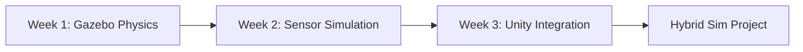

# Module 2: The Digital Twin (Gazebo & Unity Simulation)

## 📚 Learning Path Overview

**Duration:** 3 weeks (10-14 hours/week)
**Difficulty:** Intermediate to Advanced
**Prerequisites:**
- ✅ Completed Module 1 (ROS 2)
- ✅ Basic physics (kinematics, dynamics)
- ✅ 3D coordinate systems understanding

**Learning Progression:**


**By the end of this module:**
- ✅ Simulate robots with realistic physics (gravity, friction, collisions)
- ✅ Model sensors: LiDAR, cameras, IMUs, depth sensors
- ✅ Build photorealistic environments in Unity
- ✅ Test robot algorithms in safe virtual worlds

---

## Week 1: Gazebo Physics Engine & World Building

### 🎯 Learning Objectives
1. Understand rigid body physics and collision detection
2. Build simulation worlds with terrains and obstacles
3. Apply forces, torques, and gravity to robots
4. Debug physics issues using Gazebo GUI

### 📖 Theory

**Why Simulate?**
```
Real Robot Testing          Simulation Testing
├─ Expensive ($$$)          ├─ Free
├─ Slow iterations          ├─ Instant reset
├─ Risk of damage           ├─ Safe failure
├─ Limited environments     ├─ Any scenario
└─ Hard to debug            └─ Full observability
```

**Physics Engine Components:**
- **Rigid Body Dynamics:** F = ma, torque = I×α
- **Collision Detection:** Mesh vs primitive shapes
- **Contact Forces:** Normal forces, friction cones
- **Constraints:** Joints, springs, dampers

### 💻 Code Example 1: Simple Gazebo World

```xml
<!-- File: robot_world.world -->
<?xml version="1.0"?>
<sdf version="1.6">
  <world name="robot_arena">

    <!-- Physics engine settings -->
    <physics type="ode">
      <max_step_size>0.001</max_step_size>
      <real_time_factor>1.0</real_time_factor>
      <real_time_update_rate>1000</real_time_update_rate>
      <gravity>0 0 -9.81</gravity>
    </physics>

    <!-- Sun lighting -->
    <include>
      <uri>model://sun</uri>
    </include>

    <!-- Ground plane -->
    <include>
      <uri>model://ground_plane</uri>
    </include>

    <!-- Custom obstacle: Box -->
    <model name="obstacle_box">
      <static>true</static>
      <pose>2 0 0.5 0 0 0</pose>
      <link name="box_link">
        <collision name="box_collision">
          <geometry>
            <box>
              <size>1 1 1</size>
            </box>
          </geometry>
        </collision>
        <visual name="box_visual">
          <geometry>
            <box>
              <size>1 1 1</size>
            </box>
          </geometry>
          <material>
            <ambient>1 0 0 1</ambient>
            <diffuse>1 0 0 1</diffuse>
          </material>
        </visual>
      </link>
    </model>

    <!-- Ramp for testing -->
    <model name="ramp">
      <static>true</static>
      <pose>-3 0 0 0 0.3 0</pose>
      <link name="ramp_link">
        <collision name="ramp_collision">
          <geometry>
            <box>
              <size>2 2 0.1</size>
            </box>
          </geometry>
          <surface>
            <friction>
              <ode>
                <mu>0.8</mu>
                <mu2>0.8</mu2>
              </ode>
            </friction>
          </surface>
        </collision>
        <visual name="ramp_visual">
          <geometry>
            <box>
              <size>2 2 0.1</size>
            </box>
          </geometry>
          <material>
            <ambient>0 1 0 1</ambient>
          </material>
        </visual>
      </link>
    </model>

  </world>
</sdf>
```

### 💻 Code Example 2: Gazebo Launch File (ROS 2)

```python
# File: gazebo_world_launch.py
from launch import LaunchDescription
from launch.actions import IncludeLaunchDescription, DeclareLaunchArgument
from launch.launch_description_sources import PythonLaunchDescriptionSource
from launch_ros.actions import Node
from launch.substitutions import LaunchConfiguration
from ament_index_python.packages import get_package_share_directory
import os

def generate_launch_description():
    pkg_share = get_package_share_directory('my_robot_sim')
    world_file = os.path.join(pkg_share, 'worlds', 'robot_world.world')
    urdf_file = os.path.join(pkg_share, 'urdf', 'robot.urdf')

    # Declare arguments
    use_sim_time = LaunchConfiguration('use_sim_time', default='true')

    # Launch Gazebo with custom world
    gazebo = IncludeLaunchDescription(
        PythonLaunchDescriptionSource([
            os.path.join(get_package_share_directory('gazebo_ros'),
                        'launch', 'gazebo.launch.py')
        ]),
        launch_arguments={
            'world': world_file,
            'verbose': 'true',
            'pause': 'false'
        }.items()
    )

    # Spawn robot model
    spawn_robot = Node(
        package='gazebo_ros',
        executable='spawn_entity.py',
        arguments=[
            '-entity', 'my_robot',
            '-file', urdf_file,
            '-x', '0', '-y', '0', '-z', '0.5',
            '-robot_namespace', 'robot1'
        ],
        output='screen'
    )

    # Robot state publisher
    robot_state_publisher = Node(
        package='robot_state_publisher',
        executable='robot_state_publisher',
        parameters=[{
            'use_sim_time': use_sim_time,
            'robot_description': open(urdf_file).read()
        }]
    )

    return LaunchDescription([
        DeclareLaunchArgument('use_sim_time', default_value='true'),
        gazebo,
        spawn_robot,
        robot_state_publisher
    ])
```

### 💻 Code Example 3: Apply Forces to Robot

```python
# File: force_controller.py
import rclpy
from rclpy.node import Node
from gazebo_msgs.srv import ApplyBodyWrench
from geometry_msgs.msg import Wrench, Point, Vector3
from std_msgs.msg import String

class ForceController(Node):
    def __init__(self):
        super().__init__('force_controller')

        # Service client to apply forces in Gazebo
        self.force_client = self.create_client(
            ApplyBodyWrench,
            '/gazebo/apply_body_wrench'
        )

        while not self.force_client.wait_for_service(timeout_sec=1.0):
            self.get_logger().info('Waiting for Gazebo service...')

        # Subscribe to commands
        self.cmd_sub = self.create_subscription(
            String,
            '/robot/push_command',
            self.command_callback,
            10
        )

        self.get_logger().info('Force controller ready')

    def command_callback(self, msg):
        """Apply force based on command"""
        command = msg.data.lower()

        force = Vector3()
        if command == 'forward':
            force.x = 10.0
        elif command == 'backward':
            force.x = -10.0
        elif command == 'left':
            force.y = 10.0
        elif command == 'right':
            force.y = -10.0
        elif command == 'up':
            force.z = 20.0
        else:
            self.get_logger().warn(f'Unknown command: {command}')
            return

        self.apply_force(force)

    def apply_force(self, force_vector):
        """Apply a force to the robot"""
        request = ApplyBodyWrench.Request()

        request.body_name = 'my_robot::base_link'

        # Define wrench (force + torque)
        wrench = Wrench()
        wrench.force = force_vector
        wrench.torque = Vector3()  # No torque

        request.wrench = wrench
        request.reference_point = Point()  # Center of mass
        request.duration.sec = 1  # 1 second duration

        # Send request
        future = self.force_client.call_async(request)
        future.add_done_callback(self.force_callback)

    def force_callback(self, future):
        try:
            response = future.result()
            if response.success:
                self.get_logger().info('Force applied successfully!')
            else:
                self.get_logger().warn(f'Failed: {response.status_message}')
        except Exception as e:
            self.get_logger().error(f'Service call failed: {str(e)}')

def main(args=None):
    rclpy.init(args=args)
    node = ForceController()
    rclpy.spin(node)
    node.destroy_node()
    rclpy.shutdown()

if __name__ == '__main__':
    main()
```

### 📊 Physics Simulation Architecture

```
┌─────────────────────────────────────┐
│       Gazebo Simulation             │
│                                     │
│  ┌───────────┐    ┌──────────────┐ │
│  │  Physics  │───>│ Rigid Body   │ │
│  │  Engine   │    │  Dynamics    │ │
│  │  (ODE)    │    │  F=ma        │ │
│  └───────────┘    └──────────────┘ │
│         │                           │
│         ├──> Collision Detection    │
│         ├──> Contact Forces         │
│         ├──> Joint Constraints      │
│         └──> Friction Models        │
│                                     │
│  ┌────────────────────────────────┐│
│  │   Sensors  (LiDAR, Camera)    ││
│  └────────────────────────────────┘│
└─────────────────────────────────────┘
         │
         ▼
   ROS 2 Topics (/scan, /camera, /odom)
         │
         ▼
   ┌──────────────┐
   │  Controller  │
   │    Nodes     │
   └──────────────┘
```

### 🔬 Lab Exercise 1: Obstacle Course Navigation

**Task:** Create a Gazebo world with:
1. Start zone and goal zone
2. 5+ obstacles (boxes, cylinders, ramps)
3. A mobile robot with differential drive
4. Python node that navigates autonomously
5. Emergency stop on collision detection

**Bonus Challenge:**
- Add moving obstacles
- Implement path planning (A* or RRT)

**Deliverable:**
- `obstacle_course.world` file
- `navigator.py` node
- Video showing successful navigation

### ✅ Week 1 Assessment Checklist
- [ ] Build custom Gazebo world with 5+ objects
- [ ] Spawn robot programmatically via ROS 2
- [ ] Apply forces/torques using Gazebo services
- [ ] Adjust physics parameters (gravity, friction, mass)
- [ ] Use Gazebo GUI to inspect collisions and forces

---

## Week 2: Sensor Simulation (LiDAR, Camera, IMU)

### 🎯 Learning Objectives
1. Add sensor plugins to robot URDF/SDF
2. Process simulated sensor data in ROS 2
3. Understand sensor noise models
4. Implement sensor fusion algorithms

### 📖 Theory

**Sensor Types & Applications:**
```
┌──────────────┬───────────────┬─────────────────┐
│   Sensor     │   Output      │   Use Case      │
├──────────────┼───────────────┼─────────────────┤
│ 2D LiDAR     │ LaserScan     │ 2D Mapping      │
│ 3D LiDAR     │ PointCloud    │ 3D Perception   │
│ RGB Camera   │ Image         │ Object Detect   │
│ Depth Camera │ DepthImage    │ 3D Vision       │
│ IMU          │ Accel + Gyro  │ Orientation     │
│ GPS          │ NavSatFix     │ Localization    │
└──────────────┴───────────────┴─────────────────┘
```

**Sensor Noise Models:**
- **Gaussian Noise:** N(μ=0, σ²) - Most common
- **Bias Drift:** Slow accumulation over time
- **Quantization:** Discrete sensor resolution
- **Outliers:** Random spurious readings

### 💻 Code Example 4: 2D LiDAR Sensor Plugin

```xml
<!-- Add to robot URDF -->
<gazebo reference="lidar_link">
  <sensor name="lidar_sensor" type="ray">
    <pose>0 0 0 0 0 0</pose>
    <visualize>true</visualize>
    <update_rate>10</update_rate>

    <ray>
      <scan>
        <horizontal>
          <samples>360</samples>
          <resolution>1</resolution>
          <min_angle>-3.14159</min_angle>
          <max_angle>3.14159</max_angle>
        </horizontal>
      </scan>
      <range>
        <min>0.12</min>
        <max>10.0</max>
        <resolution>0.01</resolution>
      </range>

      <!-- Realistic noise model -->
      <noise>
        <type>gaussian</type>
        <mean>0.0</mean>
        <stddev>0.01</stddev>
      </noise>
    </ray>

    <!-- ROS 2 plugin -->
    <plugin name="gazebo_ros_laser" filename="libgazebo_ros_ray_sensor.so">
      <ros>
        <namespace>/robot</namespace>
        <remapping>~/out:=scan</remapping>
      </ros>
      <output_type>sensor_msgs/LaserScan</output_type>
      <frame_name>lidar_link</frame_name>
    </plugin>
  </sensor>
</gazebo>
```

### 💻 Code Example 5: RGB-D Camera Plugin

```xml
<gazebo reference="camera_link">
  <sensor name="rgbd_camera" type="depth">
    <camera>
      <horizontal_fov>1.047</horizontal_fov>  <!-- 60 degrees -->
      <image>
        <width>640</width>
        <height>480</height>
        <format>R8G8B8</format>
      </image>
      <clip>
        <near>0.1</near>
        <far>10.0</far>
      </clip>

      <!-- Lens distortion model -->
      <distortion>
        <k1>-0.1</k1>
        <k2>0.05</k2>
        <k3>0.0</k3>
        <p1>0.0</p1>
        <p2>0.0</p2>
        <center>0.5 0.5</center>
      </distortion>

      <!-- Image noise -->
      <noise>
        <type>gaussian</type>
        <mean>0.0</mean>
        <stddev>0.007</stddev>
      </noise>
    </camera>

    <!-- ROS 2 Camera Plugin -->
    <plugin name="camera_controller" filename="libgazebo_ros_camera.so">
      <ros>
        <namespace>/robot</namespace>
        <remapping>image_raw:=camera/image</remapping>
        <remapping>depth/image_raw:=camera/depth</remapping>
        <remapping>camera_info:=camera/camera_info</remapping>
      </ros>
      <frame_name>camera_link</frame_name>
    </plugin>

    <update_rate>30</update_rate>
  </sensor>
</gazebo>
```

### 💻 Code Example 6: LiDAR Obstacle Detection

```python
# File: lidar_processor.py
import rclpy
from rclpy.node import Node
from sensor_msgs.msg import LaserScan
from std_msgs.msg import Bool
import numpy as np

class LidarProcessor(Node):
    def __init__(self):
        super().__init__('lidar_processor')

        self.scan_sub = self.create_subscription(
            LaserScan,
            '/robot/scan',
            self.scan_callback,
            10
        )

        # Publish collision warning
        self.collision_pub = self.create_publisher(Bool, '/collision_warning', 10)

        # Parameters
        self.safe_distance = 0.5  # meters
        self.obstacle_threshold = 1.0  # meters

        self.get_logger().info('LiDAR processor started')

    def scan_callback(self, msg):
        """Process laser scan for obstacle detection"""
        ranges = np.array(msg.ranges)

        # Filter invalid readings
        valid_ranges = ranges[np.isfinite(ranges)]

        if len(valid_ranges) == 0:
            return

        # Find closest obstacle
        min_distance = np.min(valid_ranges)
        min_index = np.argmin(ranges)

        # Calculate angle
        angle = msg.angle_min + (min_index * msg.angle_increment)
        angle_deg = np.degrees(angle)

        # Collision warning
        collision_warning = Bool()
        if min_distance < self.safe_distance:
            self.get_logger().warn(
                f'COLLISION WARNING! Obstacle at {min_distance:.2f}m, '
                f'{angle_deg:.1f}°'
            )
            collision_warning.data = True
        else:
            collision_warning.data = False

        self.collision_pub.publish(collision_warning)

        # Find navigable gaps
        gaps = self.find_navigable_gaps(ranges, msg)

        if gaps:
            best_gap = max(gaps, key=lambda g: g['width'])
            self.get_logger().info(
                f'Best gap at {np.degrees(best_gap["angle"]):.1f}° '
                f'(width: {np.degrees(best_gap["width"]):.1f}°)'
            )

    def find_navigable_gaps(self, ranges, scan_msg, threshold=1.0):
        """Identify open spaces for navigation"""
        gaps = []
        in_gap = False
        gap_start = 0

        for i, r in enumerate(ranges):
            # Check if reading is valid and beyond threshold
            is_open = r > threshold and not np.isinf(r)

            if is_open and not in_gap:
                gap_start = i
                in_gap = True
            elif not is_open and in_gap:
                gap_end = i - 1
                gap_center_idx = (gap_start + gap_end) / 2
                gap_angle = scan_msg.angle_min + \
                           (gap_center_idx * scan_msg.angle_increment)
                gap_width = (gap_end - gap_start) * scan_msg.angle_increment

                gaps.append({
                    'angle': gap_angle,
                    'width': gap_width,
                    'start_idx': gap_start,
                    'end_idx': gap_end
                })
                in_gap = False

        return gaps

def main(args=None):
    rclpy.init(args=args)
    node = LidarProcessor()
    rclpy.spin(node)
    node.destroy_node()
    rclpy.shutdown()

if __name__ == '__main__':
    main()
```

### 💻 Code Example 7: IMU Sensor Fusion

```python
# File: imu_fusion.py
import rclpy
from rclpy.node import Node
from sensor_msgs.msg import Imu
from geometry_msgs.msg import Vector3Stamped
import numpy as np
from scipy.spatial.transform import Rotation

class IMUFusion(Node):
    def __init__(self):
        super().__init__('imu_fusion')

        self.imu_sub = self.create_subscription(
            Imu,
            '/robot/imu',
            self.imu_callback,
            10
        )

        # Publish fused orientation
        self.orientation_pub = self.create_publisher(
            Vector3Stamped,
            '/robot/orientation',
            10
        )

        # Complementary filter state
        self.roll = 0.0
        self.pitch = 0.0
        self.yaw = 0.0

        # Filter coefficient (0.98 = trust gyro more)
        self.alpha = 0.98

        self.last_time = None

        self.get_logger().info('IMU fusion node started')

    def imu_callback(self, msg):
        """Apply complementary filter for sensor fusion"""
        current_time = self.get_clock().now()

        if self.last_time is None:
            self.last_time = current_time
            return

        # Calculate dt
        dt = (current_time - self.last_time).nanoseconds / 1e9
        self.last_time = current_time

        # === Gyroscope Integration ===
        gyro_x = msg.angular_velocity.x
        gyro_y = msg.angular_velocity.y
        gyro_z = msg.angular_velocity.z

        gyro_roll = self.roll + gyro_x * dt
        gyro_pitch = self.pitch + gyro_y * dt
        gyro_yaw = self.yaw + gyro_z * dt

        # === Accelerometer Angles ===
        accel_x = msg.linear_acceleration.x
        accel_y = msg.linear_acceleration.y
        accel_z = msg.linear_acceleration.z

        # Calculate roll and pitch from accelerometer
        accel_roll = np.arctan2(accel_y, accel_z)
        accel_pitch = np.arctan2(
            -accel_x,
            np.sqrt(accel_y**2 + accel_z**2)
        )

        # === Complementary Filter Fusion ===
        self.roll = self.alpha * gyro_roll + (1 - self.alpha) * accel_roll
        self.pitch = self.alpha * gyro_pitch + (1 - self.alpha) * accel_pitch
        self.yaw = gyro_yaw  # No magnetometer, so just integrate gyro

        # Publish fused orientation
        orientation_msg = Vector3Stamped()
        orientation_msg.header.stamp = current_time.to_msg()
        orientation_msg.header.frame_id = 'imu_link'
        orientation_msg.vector.x = self.roll
        orientation_msg.vector.y = self.pitch
        orientation_msg.vector.z = self.yaw

        self.orientation_pub.publish(orientation_msg)

        self.get_logger().info(
            f'Orientation (deg) - '
            f'Roll: {np.degrees(self.roll):.1f}, '
            f'Pitch: {np.degrees(self.pitch):.1f}, '
            f'Yaw: {np.degrees(self.yaw):.1f}'
        )

def main(args=None):
    rclpy.init(args=args)
    node = IMUFusion()
    rclpy.spin(node)
    node.destroy_node()
    rclpy.shutdown()

if __name__ == '__main__':
    main()
```

### 🔬 Lab Exercise 2: Sensor-Based Wall Following

**Task:** Implement a wall-following robot using LiDAR
1. Keep 0.5m distance from right wall
2. Handle corners smoothly
3. Detect and avoid obstacles
4. Work in any maze-like environment

**Algorithm Structure:**
```python
def wall_follow_control(scan_data):
    right_distance = get_right_wall_distance(scan_data)

    if right_distance > 0.6:
        turn_right()
    elif right_distance < 0.4:
        turn_left()
    else:
        go_straight()
```

**Deliverable:**
- `wall_follower.py` node
- Test in Gazebo maze world
- Video demonstration

### ✅ Week 2 Assessment Checklist
- [ ] Add 3+ sensor types to robot URDF
- [ ] Process LiDAR scans for obstacle detection
- [ ] Implement complementary filter for IMU
- [ ] Visualize camera feed in RViz
- [ ] Configure realistic sensor noise parameters

---

## Week 3: Unity Integration for Photorealistic Rendering

### 🎯 Learning Objectives
1. Set up Unity with ROS 2 bridge (ROS-TCP-Connector)
2. Create high-fidelity visual environments
3. Generate synthetic training data for ML models
4. Compare Gazebo vs Unity trade-offs

### 📖 Theory

**Gazebo vs Unity Comparison:**
```
┌────────────┬─────────────────┬─────────────────┐
│  Feature   │     Gazebo      │      Unity      │
├────────────┼─────────────────┼─────────────────┤
│ Graphics   │ Basic/Moderate  │ Photorealistic  │
│ Physics    │ Very Accurate   │ Good (PhysX)    │
│ ML Dataset │ Limited         │ Excellent       │
│ Setup      │ ROS Native      │ Needs Bridge    │
│ Speed      │ Real-time       │ GPU-dependent   │
│ Best For   │ Physics testing │ Vision/ML data  │
└────────────┴─────────────────┴─────────────────┘
```

**Use Cases:**
- **Gazebo:** Control validation, physics simulation
- **Unity:** Computer vision, synthetic datasets, demos, VR

### 💻 Code Example 8: Unity ROS Connection

```csharp
// File: ROSConnectionManager.cs (Unity C#)
using UnityEngine;
using Unity.Robotics.ROSTCPConnector;
using RosMessageTypes.Geometry;
using RosMessageTypes.Std;

public class ROSConnectionManager : MonoBehaviour
{
    [Header("ROS Settings")]
    public string rosIPAddress = "127.0.0.1";
    public int rosPort = 10000;

    [Header("Robot Control")]
    public Rigidbody robotRigidbody;
    public float speedMultiplier = 1.0f;

    private ROSConnection ros;

    void Start()
    {
        // Connect to ROS 2
        ros = ROSConnection.GetOrCreateInstance();
        ros.Connect(rosIPAddress, rosPort);

        Debug.Log($"Connected to ROS at {rosIPAddress}:{rosPort}");

        // Subscribe to velocity commands
        ros.Subscribe<TwistMsg>("/cmd_vel", ApplyVelocityCommand);

        // Publish robot status
        InvokeRepeating("PublishStatus", 1.0f, 0.1f);
    }

    void ApplyVelocityCommand(TwistMsg twist)
    {
        if (robotRigidbody == null) return;

        // Extract linear and angular velocities
        float linearX = (float)twist.linear.x * speedMultiplier;
        float angularZ = (float)twist.angular.z * speedMultiplier;

        // Apply to rigidbody
        Vector3 velocity = transform.forward * linearX;
        robotRigidbody.velocity = velocity;

        Vector3 angularVel = Vector3.up * angularZ;
        robotRigidbody.angularVelocity = angularVel;

        Debug.Log($"Cmd: Linear={linearX:F2}, Angular={angularZ:F2}");
    }

    void PublishStatus()
    {
        // Publish heartbeat
        StringMsg status = new StringMsg("Unity robot active");
        ros.Publish("/robot/status", status);
    }

    void OnApplicationQuit()
    {
        ros.Disconnect();
    }
}
```

### 💻 Code Example 9: Unity Camera Publisher

```csharp
// File: CameraImagePublisher.cs
using UnityEngine;
using Unity.Robotics.ROSTCPConnector;
using RosMessageTypes.Sensor;
using RosMessageTypes.Std;

public class CameraImagePublisher : MonoBehaviour
{
    [Header("Camera Settings")]
    public Camera robotCamera;
    public string topicName = "/robot/camera/image";
    public int publishRateHz = 10;

    [Header("Image Settings")]
    public int imageWidth = 640;
    public int imageHeight = 480;

    private ROSConnection ros;
    private float timer;
    private float publishInterval;

    void Start()
    {
        ros = ROSConnection.GetOrCreateInstance();
        ros.RegisterPublisher<ImageMsg>(topicName);

        publishInterval = 1.0f / publishRateHz;

        if (robotCamera == null)
        {
            robotCamera = GetComponent<Camera>();
        }

        Debug.Log($"Camera publisher started on {topicName}");
    }

    void Update()
    {
        timer += Time.deltaTime;

        if (timer >= publishInterval)
        {
            PublishCameraImage();
            timer = 0;
        }
    }

    void PublishCameraImage()
    {
        // Create render texture
        RenderTexture rt = new RenderTexture(
            imageWidth, imageHeight, 24, RenderTextureFormat.ARGB32
        );

        robotCamera.targetTexture = rt;
        robotCamera.Render();

        // Read pixels
        RenderTexture.active = rt;
        Texture2D image = new Texture2D(
            imageWidth, imageHeight, TextureFormat.RGB24, false
        );
        image.ReadPixels(new Rect(0, 0, imageWidth, imageHeight), 0, 0);
        image.Apply();

        // Create ROS message
        ImageMsg msg = new ImageMsg();

        // Header
        HeaderMsg header = new HeaderMsg();
        header.stamp = GetROSTimestamp();
        header.frame_id = "camera_link";
        msg.header = header;

        // Image data
        msg.height = (uint)imageHeight;
        msg.width = (uint)imageWidth;
        msg.encoding = "rgb8";
        msg.is_bigendian = 0;
        msg.step = (uint)(imageWidth * 3);
        msg.data = image.GetRawTextureData();

        // Publish
        ros.Publish(topicName, msg);

        // Cleanup
        robotCamera.targetTexture = null;
        RenderTexture.active = null;
        Destroy(rt);
        Destroy(image);
    }

    RosMessageTypes.BuiltinInterfaces.TimeMsg GetROSTimestamp()
    {
        double unixTime = (System.DateTime.UtcNow -
                          new System.DateTime(1970, 1, 1)).TotalSeconds;

        return new RosMessageTypes.BuiltinInterfaces.TimeMsg
        {
            sec = (int)unixTime,
            nanosec = (uint)((unixTime % 1) * 1e9)
        };
    }
}
```

### 💻 Code Example 10: Synthetic Data Generator

```csharp
// File: SyntheticDataGenerator.cs
using UnityEngine;
using System.IO;
using System.Collections.Generic;

public class SyntheticDataGenerator : MonoBehaviour
{
    [Header("Dataset Settings")]
    public string datasetPath = "D:/Datasets/RobotVision";
    public int imagesToGenerate = 1000;
    public Camera captureCamera;

    [Header("Randomization")]
    public GameObject[] objectPrefabs;
    public Material[] skyboxMaterials;
    public Light sunLight;

    private int capturedCount = 0;

    public void GenerateDataset()
    {
        StartCoroutine(GenerateDatasetCoroutine());
    }

    System.Collections.IEnumerator GenerateDatasetCoroutine()
    {
        // Create directories
        Directory.CreateDirectory(Path.Combine(datasetPath, "images"));
        Directory.CreateDirectory(Path.Combine(datasetPath, "labels"));

        for (int i = 0; i < imagesToGenerate; i++)
        {
            // Randomize scene
            RandomizeScene();

            // Wait for physics to settle
            yield return new WaitForSeconds(0.1f);

            // Capture image and labels
            CaptureFrame(i);

            capturedCount++;
            Debug.Log($"Captured {capturedCount}/{imagesToGenerate}");
        }

        Debug.Log("Dataset generation complete!");
    }

    void RandomizeScene()
    {
        // Random lighting
        if (sunLight != null)
        {
            sunLight.intensity = Random.Range(0.5f, 2.0f);
            sunLight.transform.rotation = Quaternion.Euler(
                Random.Range(30f, 80f),
                Random.Range(0f, 360f),
                0
            );
        }

        // Random skybox
        if (skyboxMaterials.Length > 0)
        {
            RenderSettings.skybox =
                skyboxMaterials[Random.Range(0, skyboxMaterials.Length)];
        }

        // Spawn random objects
        ClearSpawnedObjects();
        int numObjects = Random.Range(5, 15);

        for (int i = 0; i < numObjects; i++)
        {
            GameObject prefab = objectPrefabs[Random.Range(0, objectPrefabs.Length)];
            Vector3 position = new Vector3(
                Random.Range(-5f, 5f),
                Random.Range(0.5f, 2f),
                Random.Range(2f, 10f)
            );

            GameObject obj = Instantiate(prefab, position, Random.rotation);
            obj.tag = "SpawnedObject";
        }
    }

    void CaptureFrame(int index)
    {
        // Capture image
        string imagePath = Path.Combine(
            datasetPath, "images", $"img_{index:D4}.jpg"
        );

        ScreenCapture.CaptureScreenshot(imagePath);

        // Generate YOLO labels
        string labelPath = Path.Combine(
            datasetPath, "labels", $"img_{index:D4}.txt"
        );

        GenerateYOLOLabels(labelPath);
    }

    void GenerateYOLOLabels(string filePath)
    {
        List<string> labels = new List<string>();

        GameObject[] objects = GameObject.FindGameObjectsWithTag("SpawnedObject");

        foreach (GameObject obj in objects)
        {
            // Get bounding box in camera view
            Bounds bounds = GetObjectBounds(obj);

            if (IsInCameraView(bounds))
            {
                // Calculate YOLO format (normalized coords)
                Vector2 center = GetNormalizedCenter(bounds);
                Vector2 size = GetNormalizedSize(bounds);

                // Class ID (0 for now, extend for multiple classes)
                int classId = 0;

                labels.Add($"{classId} {center.x} {center.y} {size.x} {size.y}");
            }
        }

        File.WriteAllLines(filePath, labels);
    }

    Bounds GetObjectBounds(GameObject obj)
    {
        Renderer renderer = obj.GetComponent<Renderer>();
        return renderer != null ? renderer.bounds : new Bounds();
    }

    bool IsInCameraView(Bounds bounds)
    {
        Vector3 screenPoint = captureCamera.WorldToViewportPoint(bounds.center);
        return screenPoint.z > 0 &&
               screenPoint.x > 0 && screenPoint.x < 1 &&
               screenPoint.y > 0 && screenPoint.y < 1;
    }

    Vector2 GetNormalizedCenter(Bounds bounds)
    {
        Vector3 screenPoint = captureCamera.WorldToViewportPoint(bounds.center);
        return new Vector2(screenPoint.x, screenPoint.y);
    }

    Vector2 GetNormalizedSize(Bounds bounds)
    {
        // Simplified - calculate actual bounding box size
        return new Vector2(0.1f, 0.1f); // Placeholder
    }

    void ClearSpawnedObjects()
    {
        GameObject[] objects = GameObject.FindGameObjectsWithTag("SpawnedObject");
        foreach (GameObject obj in objects)
        {
            Destroy(obj);
        }
    }
}
```

### 🔬 Lab Exercise 3: ML Dataset Creation

**Task:** Build a Unity scene for synthetic data generation
1. Create environment with varied lighting
2. Spawn 10-20 random objects per scene
3. Capture RGB + depth images
4. Generate YOLO-format labels
5. Export 500+ labeled images

**Dataset Requirements:**
```
/dataset
  /images
    img_0000.jpg
    img_0001.jpg
    ...
  /labels (YOLO format)
    img_0000.txt
    img_0001.txt
    ...
  /depth
    depth_0000.png
    ...
```

**Deliverable:**
- Unity project with randomization
- Python script to verify dataset
- Train simple YOLOv8 model on your data

### ✅ Week 3 Assessment Checklist
- [ ] Set up Unity-ROS 2 TCP connection
- [ ] Publish camera images from Unity to ROS
- [ ] Subscribe to velocity commands in Unity
- [ ] Build photorealistic environment
- [ ] Generate 100+ synthetic labeled images

---

## 📝 Module Summary

### Key Concepts Mastered
1. **Physics Simulation (Gazebo)**
   - Rigid body dynamics and collision detection
   - Force/torque application and constraints
   - World building with SDF format

2. **Sensor Modeling**
   - LiDAR raytracing and obstacle detection
   - Camera rendering with distortion models
   - IMU sensor fusion (complementary filter)
   - Realistic noise and bias models

3. **Photorealistic Rendering (Unity)**
   - Unity-ROS 2 bridge integration
   - High-fidelity visual environments
   - Synthetic dataset generation for ML
   - Camera image streaming to ROS

### Real-World Applications
- **Autonomous Vehicles:** Test perception in simulated cities
- **Warehouse Robots:** Validate navigation before deployment
- **ML Training:** Generate infinite labeled training data
- **Human-Robot Interaction:** Prototype interfaces in VR

### Common Pitfalls & Solutions
| Problem | Solution |
|---------|----------|
| Robot falls through ground | Verify collision geometry exists |
| Sensors return no data | Check plugin is loaded and topics match |
| Simulation too slow | Reduce physics step size or sensor rate |
| Unity-ROS disconnects | Check firewall, ensure IP/port correct |
| Noisy sensor data | Tune Gaussian noise parameters |

### Simulation Best Practices
1. **Start Simple:** Test with basic worlds before complex ones
2. **Validate Physics:** Compare sim vs real-world measurements
3. **Profile Performance:** Monitor real-time factor
4. **Version Control:** Track world files and robot models
5. **Document Assumptions:** Note what's simplified

### Next Steps
✅ Module 3: NVIDIA Isaac Sim (GPU-accelerated, photorealistic physics)
✅ Implement SLAM with simulated sensor data
✅ Train perception models on synthetic datasets
✅ Deploy algorithms on real hardware

---

## 🎓 Final Project: Multi-Environment Testing Suite

**Objective:** Test the same navigation algorithm in 3 different environments.

**Requirements:**
1. **Gazebo World 1:** Indoor office with narrow hallways
2. **Gazebo World 2:** Outdoor terrain with slopes
3. **Unity Scene:** Warehouse with dynamic lighting
4. **Navigation Controller:** Single ROS 2 node works in all 3
5. **Performance Report:** Compare success rates, timing

**Metrics to Measure:**
- Navigation success rate
- Average completion time
- Collision frequency
- CPU/GPU usage
- Sensor data quality

**Grading Rubric:**
- Gazebo worlds design quality (20%)
- Unity scene realism (20%)
- Controller robustness (30%)
- Performance analysis report (20%)
- Demo video showing all 3 envs (10%)

**Submission:** GitHub repo + analysis PDF + 5-min video

---

## 📚 Additional Resources

**Official Documentation:**
- [Gazebo Tutorials](http://gazebosim.org/tutorials)
- [Unity Robotics Hub](https://github.com/Unity-Technologies/Unity-Robotics-Hub)
- [ROS-TCP-Connector](https://github.com/Unity-Technologies/ROS-TCP-Connector)
- [SDF Format Spec](http://sdformat.org/)

**Video Tutorials:**
- [Gazebo Simulation Basics](https://youtube.com/gazebosim)
- [Unity for Robotics Course](https://learn.unity.com/course/unity-for-robotics)
- [Sensor Plugins Tutorial](https://youtube.com/gazeboplugins)

**Community & Forums:**
- [Gazebo Answers](https://answers.gazebosim.org/)
- [Unity Robotics Forum](https://forum.unity.com/forums/robotics.623/)
- [ROS Discourse - Simulation](https://discourse.ros.org/c/simulation)

**Recommended Tools:**
- **Blender:** Create custom 3D models for simulation
- **MeshLab:** Process and optimize mesh files
- **CloudCompare:** Visualize and edit point clouds

**Books:**
- "Gazebo Simulation" by Enis Bilgin
- "Unity Game Development Cookbook" by Paris Buttfield-Addison
- "Learning ROS for Robotics Programming" by Enrique Fernandez
